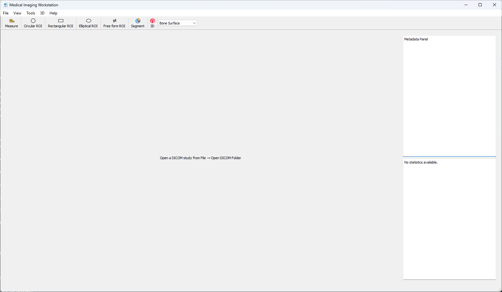
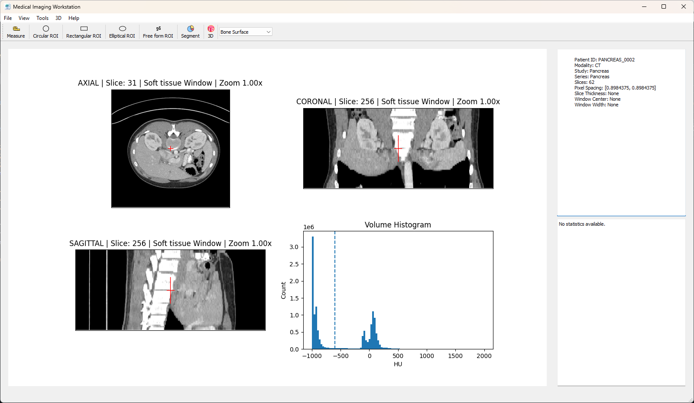
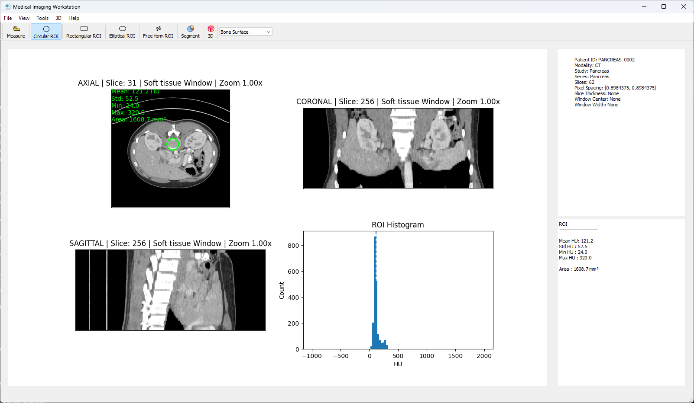
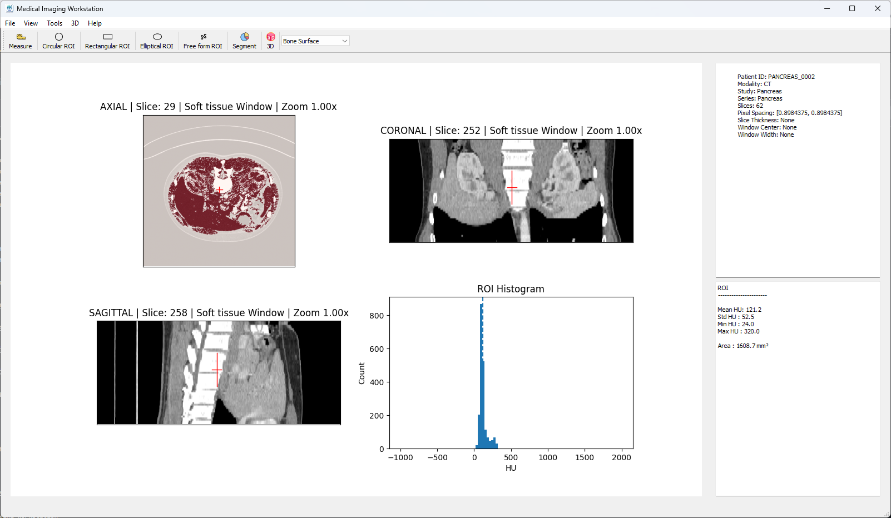
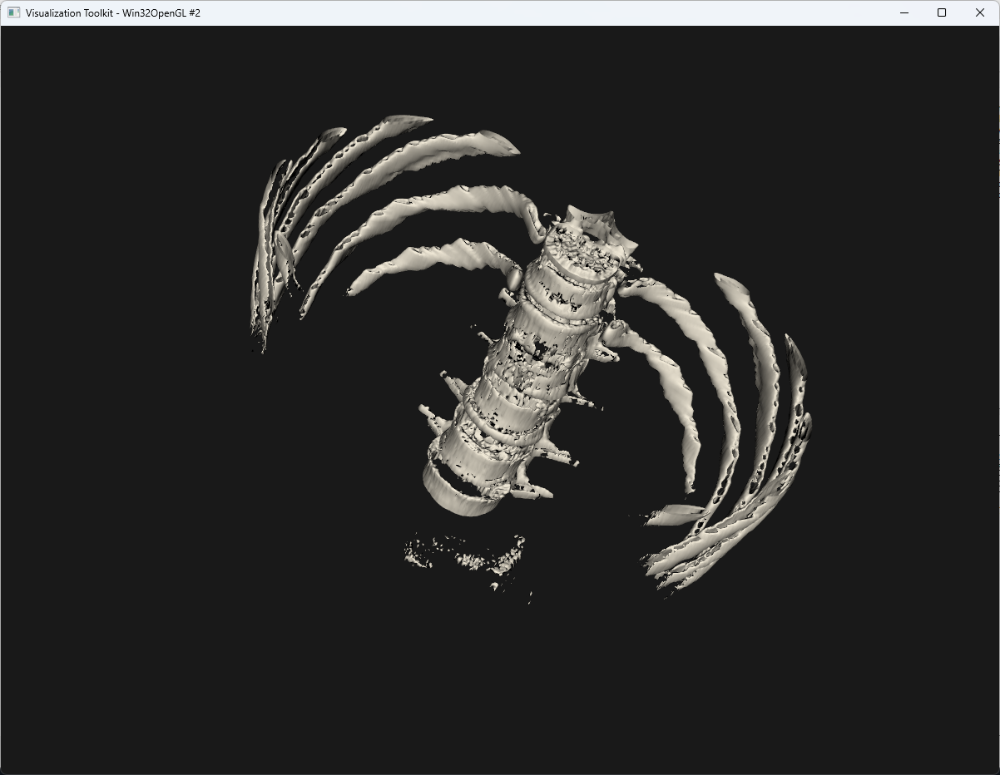

# Medical Imaging Workstation

A Python-based workstation for DICOM visualization, segmentation,
quantitative analysis and 3D reconstruction.



## Overview

Medical Imaging Workstation is a desktop application developed in Pytho for visualization and analysis of CT studies.

The software supports multiplanar reconstruction (MPR), ROI analysis, segmentation, density analysis, 3D visualization and STL export.

## Features

### DICOM Visualization

- DICOM series loading
- Metadata viewer
- Axial, Coronal and Sagittal views
- Window / Level adjustment
- CT window presets
- Crosshair navigation
- HU Probe

### Measurements

- Distance measurement
- Angle measurement

### ROI Analysis

- Circular ROI
- Rectangular ROI
- Elliptical ROI
- Free-form ROI
- ROI statistics
- Histogram visualization

### Segmentation

- Threshold segmentation
- Region growing segmentation
- Volume calculation

### 3D Visualization

- Surface rendering
- Volume rendering
- Bone preset
- Lung preset
- Soft tissue preset

### Export

- STL export
- Screenshot export

## Screenshots









## Technologies

- Python
- PyQt5
- NumPy
- Matplotlib
- pydicom
- VTK

## Repository Structure

```text
Medical-Imaging-Workstation/
│
├── controllers/
│   ├── angle_controller.py
│   ├── cine_controller.py
│   ├── crosshair_controller.py
│   ├── hu_probe_controller.py
│   ├── measurement_controller.py
│   ├── metadata_controller.py
│   ├── roi_controller.py
│   ├── viewport_controller.py
│   └── window_controller.py
│
├── core/
│   ├── dicom_loader.py
│   ├── image_stack.py
│   ├── presets.py
│   ├── segmentation.py
│   └── windowing.py
│
├── icons/
│   ├── 3d.png
│   ├── app_icon.ico
│   ├── app_icon.png
│   ├── circle.png
│   ├── ellipse.png
│   ├── free.png
│   ├── rectangle.png
│   ├── rule.png
│   └── segmentation.png
│
├── screenshots/
│   ├── 3d_render.png
│   ├── main_view.png
│   ├── mpr_viewer.png
│   ├── roi_analysis.png
│   └── segmentation.png
│
├── ui/
│   ├── main_window.py
│   ├── metadata_panel.py
│   ├── stats_panel.py
│   └── viewer_widget.py
│
├── viewer/
│   ├── viewer.py
│   └── viewer_3d.py
│
├── bone.stl
├── main.py
├── README.md
└── requirements.txt
```

## Installation

git clone https://github.com/yourusername/medical-imaging-workstation.git

cd medical-imaging-workstation

pip install -r requirements.txt

python main.py

---

## Keyboard Shortcuts

<table cellspacing="4">
<tr><td><b>↑ / ↓</b></td><td>Previous / Next Slice</td></tr>
<tr><td><b>← / →</b></td><td>Change Window Preset</td></tr>
<tr><td><b>W / X / A / D</b></td><td>Pan</td></tr>
<tr><td><b>1</b></td><td>Axial Plane</td></tr>
<tr><td><b>2</b></td><td>Coronal Plane</td></tr>
<tr><td><b>3</b></td><td>Sagittal Plane</td></tr>
<tr><td><b>M</b></td><td>Measurement Tool</td></tr>
<tr><td><b>O</b></td><td>Circular ROI</td></tr>
<tr><td><b>P</b></td><td>Rectangular ROI</td></tr>
<tr><td><b>E</b></td><td>Elliptical ROI</td></tr>
<tr><td><b>F</b></td><td>Free Form ROI</td></tr>
<tr><td><b>4</b></td><td>Lung 3D View</td></tr>
<tr><td><b>5</b></td><td>Soft Tissue 3D View</td></tr>
<tr><td><b>6</b></td><td>Bone 3D View</td></tr>
<tr><td><b>Space</b></td><td>Cine Mode</td></tr>
<tr><td><b>R</b></td><td>Reset View</td></tr>
<tr><td><b>Esc</b></td><td>Close All Tools</td></tr>
<tr><td><b>B</b></td><td>Bone Threshold Segmentation</td></tr>
<tr><td><b>L</b></td><td>Lung Threshold Segmentation</td></tr>
<tr><td><b>G</b></td><td>Region Growing Segmentation</td></tr>
<tr><td><b>Mouse Wheel</b></td><td>Scroll Slices / Zoom</td></tr>
<tr><td><b>Left Click</b></td><td>Measurement / ROI / Crosshair</td></tr>
<tr><td><b>Middle Click</b></td><td>HU Probe</td></tr>
<tr><td><b>Right Click</b></td><td>Window / Level</td></tr>
<tr><td><b>Ctrl + Drag</b></td><td>Pan</td></tr>
</table>

## STL Export

Segmented structures can be converted into polygonal meshes
using Marching Cubes and exported as STL files for:

- 3D Printing
- CAD workflows
- Point cloud processing
- Surface analysis

## Author

David Enrique Veloz Renteria

Computer Vision | Medical Imaging 

LinkedIn:
https://www.linkedin.com/in/davidveloz/?locale=en-US

GitHub:
https://github.com/DavidVeloz95
